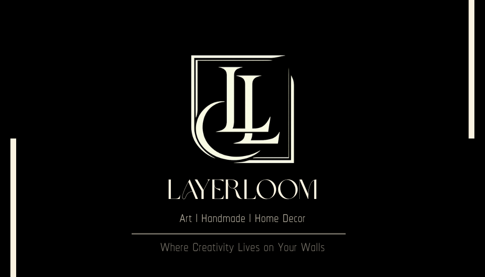
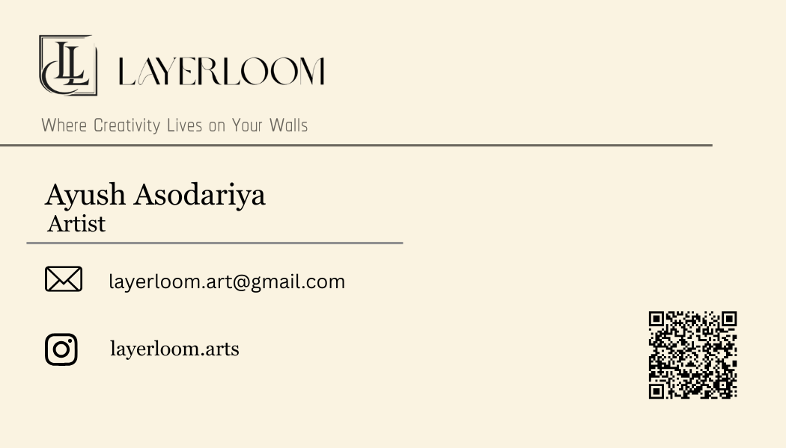

# Synent Technologies – Task 4: Business Card Design
### Layerloom — Handmade Paper Cut Art Brand

> Designed by **Ayush Asodariya** as part of the Synent Technologies Graphic Design Internship Program.

---

## 📌 Task Overview

**Task:** Business Card Design  
**Brand:** Layerloom  
**Tagline:** *Where Creativity Lives on Your Walls*  
**Tool Used:** Canva

---

## 🎨 Design Preview

### Front

### Back

---

## 💡 Design Thinking

### Layout
A clean **horizontal rule** divides the card into two zones:
- **Top half** — Brand identity (logo + tagline)
- **Bottom half** — Personal contact (name, email, Instagram, QR code)

This creates a natural visual flow and avoids the tension that a diagonal split would create.

### Front Side
- Layerloom horizontal logo top left
- Tagline: *"Where Creativity Lives on Your Walls"*
- Name: Ayush Asodariya | Title: Artist
- Email: layerloom.art@gmail.com
- Instagram: @layerloom.arts
- QR code linking to Instagram page

### Back Side
- Pure black background (#1A1A1A)
- LL monogram icon mark centered — large and commanding
- No extra elements — the mark speaks for itself

---

## 🎨 Brand Colors

| Name | Hex | Usage |
|---|---|---|
| Obsidian | `#1A1A1A` | Background, back side |
| Parchment | `#F5F0E8` | Front background, text |
| Warm Stone | `#8A7F6E` | Subtext, dividers |

---

## 📁 Files

| File | Description |
|---|---|
| `Front.png` | Business card front side |
| `Back.png` | Business card back side |

---

## 👤 About the Brand

**Layerloom** is a handmade paper cut art brand. Every piece is hand cut by one artist, one at a time, with precision and patience. The brand is built around one philosophy:

> *"Perfection can be programmed. Beauty cannot."*

---

## 🔗 Connect

- Instagram: [@layerloom.arts](https://instagram.com/layerloom.arts)
- Email: layerloom.art@gmail.com

---

*Synent Technologies Graphic Design Internship | Task 4 | Ayush Asodariya*
